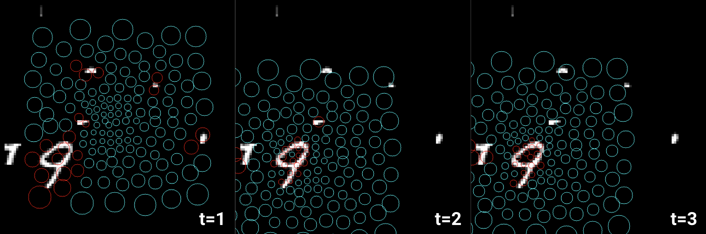

# The Emergence of Fovial Image Sampling 
An implementation of [this paper](https://arxiv.org/pdf/1611.09430) for emergent foviation of an image sampling lattice for simple recognition in cluttered environments.



## Emergent Fovial Lattice 
The following shows the sampling lattice (learned through backpropigation) evolving as the algorithm is trained on a [*Cluttered MNIST dataset*](./dataset/). The circles represent 144 unique "receptive fields" where the radius of the circles represent the standard deviation of a gaussian kernel used to sample the image. The larger the circle, the larger the receptive field.  


## Setup
Create a new conda env
```bash
conda create -n fovial -y python=3.11
conda activate fovial
```

Install the requirements:
```bash
pip install -r requirements.txt
```

## Create Cluttered MNIST Dataset
```bash
cd dataset
python3 make_dataset.py -h
```